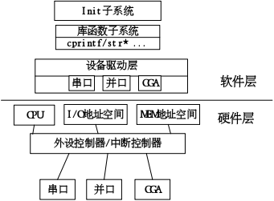
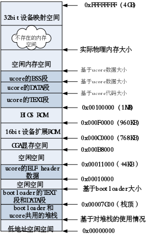

# 【实现】可输出字符串的ucore

 proj3包含了一个只能输出字符串的简单ucore操作系统，虽然简单，但它也体现了操作系统的一些结构和特征，比如它具有：
 
* 完成给ucore的BSS段清零并显示一个字符串的内核初始化子系统（init.c）
* 提供串口/并口/CGA显示的驱动程序子系统（console.c）
* 提供公共服务的操作系统函数库子系统（printf.c printfmt.c string.c）

这体现了操作系统的一个基本特征：资源管理器。从操作系统原理我们可以知道一台计算机就是一组资源，这些资源用于对数据的移动、存储和处理并进行控制。在proj3中的ucore操作系统目前只提供了对串口/并口/CGA这三种I/O设备的硬件资源的访问，每个I/O设备的操作都有自己特有的指令集或控制信号（对照一下serial_putc/lpt_putc/cga_putc函数的实现），操作系统隐藏这些细节，并提供了统一的接口（看看cprintf函数的实现），因此程序员可以使用简单的printf函数来写这些设备，达到显示数据的效果。目前操作系统的逻辑结构图架构如下图所示：

在PC中的地址空间布局图如下所示：

