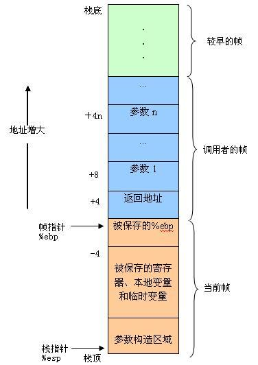

# 【背景】栈结构和处理过程

根据数据结构课程中的描述，栈是限定仅在表尾进行插入（即入栈操作）或删除操作（即出栈操作）的线性表[严蔚敏著的《数据结构》书]。因此，栈的表尾端成为称为栈顶（stack top），表头端称为栈底（stack bottom）。在X86CPU架构中有专门的指令“push”来完成入栈操作，“pop”指令来完成出栈操作，栈顶指针寄存器ESP时刻指向栈的栈顶。比较有趣的是，在x86中，采用的是满降序栈（full descending stack）机制，即栈底在高地址，栈顶在低地址，入栈的方向是向低地址进行，出栈的方向是向高地址进行，栈指针指向上次写的最后一个数据单元。GCC编译器规定的函数栈帧（stack frame）是一块存放某函数的局部变量、参数、返回地址和其它临时变量的内存空间，栈帧的大致结构和操作如下图所示：

操作系统中使用栈的目的与一般应用程序类似，不外乎包括：支持函数调用、传递函数参数、局部变量（也称自动变量）存储、函数返回值存储、在函数内部保存可能被修改的寄存器的值供恢复。除此之外，在后续讲到的中断处理、内核态/用户态切换、进程切换等方面，也需要使用栈来保存被打断的执行所用到的寄存器等硬件信息。由于在操作系统中要完成许多非常规的栈空间数据处理，比如直接修改保存在栈帧中的返回地址，使得函数返回到不同的地方去，所以我们需要在计算机体系结构和机器代码级别更加深入地理解操作系统是如何具体进行栈处理的。下面，我们将结合调试运行proj3.1来分析内核中的函数调用关系。
