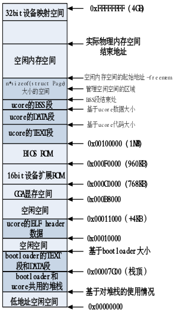
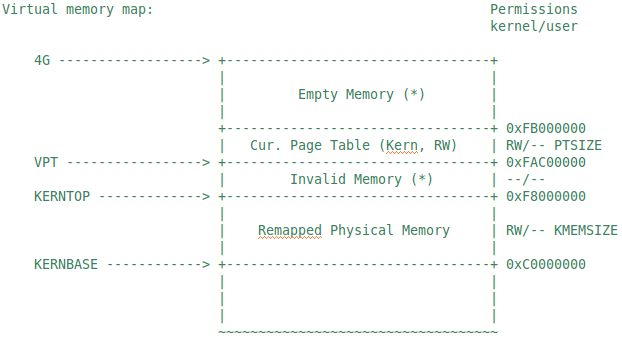

# 【实现】实现分页内存管理

##重新建立段映射

前面已经介绍了如何探测物理内存，接下来ucore需要根据物理内存的情况来建立分页管理机制。首先观察一下tools/kernel.ld文件在proj4.1和proj5中的区别，在proj4.1中：

    ENTRY(kern_init)

    SECTIONS {
        /* Load the kernel at this address: "." means the current address */
        . = 0x100000;

        .text : {
            *(.text .stub .text.* .gnu.linkonce.t.*)
        }

在porj5中：

	ENTRY(kern_entry)

    SECTIONS {
        /* Load the kernel at this address: "." means the current address */
        . = 0xC0100000;

        .text : {
            *(.text .stub .text.* .gnu.linkonce.t.*)
        }

   在意味着gcc编译出ucore的起始地址从0xC0100000开始，入口函数为kern_entry函数。这与proj4.1有很大差别。这实际上说明ucore在建立好页映射关系后，虚拟地址空间和物理地址空间之间存在如下的映射关系：
 
	Virtual Address=LinearAddress=0xC0000000+Physical Address
    
   另外，ucore的入口地址也改为了kern_entry函数，这个函数位于init/entry.S中，分析代码可以看出，entry.S重新建立了段映射关系，从以前的
 
	Virtual Address= Linear Address
改为

	Virtual Address=Linear Address-0xC0000000
    
由于gcc编译出的虚拟起始地址从0xC0100000开始，ucore被bootloader放置在从物理地址0x100000处开始的物理内存中。所以当kern_entry函数完成新的段映射关系后，且ucore在没有建立好页映射机制前，CPU按照ucore中的虚拟地址执行，能够被分段机制映射到正确的物理地址上，确保ucore运行正确。

## 初始化物理内存页分配管理

为了与以后的分页机制配合，我们首先需要建立对整个计算机的页级物理内存分配管理。这部分代码的实现在kern/default_pmm.[ch]。首先我们需要用一个数据结构来描述每个物理页（也称页帧），这里用了双向链表结构来表示每个页。链表头用free_area_t结构来表示，包含了一个list_entry结构的双向链表指针和记录当前空闲页的个数的无符号整型变量nr_free。

    /* free_area_t - maintains a doubly linked list to record free (unused) pages */
    typedef struct {
        list_entry_t free_list;			// the list header
        unsigned int nr_free;			// # of free pages in this free list
    } free_area_t;

每一个物理页的属性用结构Page来表示，它包含了映射此物理页的虚拟页个数，描述物理页属性的flags和双向链接各个Page结构的page_link双向链表。

    struct Page {
        atomic_t ref;	// page frame's reference counter
        uint32_t flags;	// array of flags that describe the status of the page frame
        list_entry_t page_link;	// free list link
    };

有了这两个数据结构，ucore就可以管理起来整个以页为单位的物理内存空间。接下来需要解决两个问题：
* 管理页级物理内存空间所需的Page结构的内存空间从哪里开始，占多大空间？
* 空闲内存空间的起始地址在哪里？

对于这两个问题，我们首先根据bootloader给出的内存布局信息找出最大的物理内存地址maxpa（定义在page_init函数中的局部变量），由于x86的起始物理内存地址为0，所以可以得知需要管理的物理页个数为

	npage = maxpa / PGSIZE

这样，我们就可以预估出管理页级物理内存空间所需的Page结构的内存空间所需的内存大小为：

	sizeof(struct Page) * npage)

由于bootloader加载ucore的结束地址（用全局指针变量end记录）以上的空间没有被使用，所以我们可以把end按页大小为边界去整后，作为管理页级物理内存空间所需的Page结构的内存空间，记为：

	pages = (struct Page *)ROUNDUP((void *)end, PGSIZE);

为了简化起见，从地址0到地址pages+ sizeof(struct Page) * npage)结束的物理内存空间设定为已占用物理内存空间（起始0~640KB的空间是空闲的），地址pages+ sizeof(struct Page) * npage)以上的空间为空闲物理内存空间，这时的空闲空间起始地址为

	uintptr_t freemem = PADDR((uintptr_t)pages + sizeof(struct Page) * npage);

为此我们需要把这两部分空间给标识出来。对于已占用物理空间，通过如下语句即可实现占用标记：

    for (i = 0; i < npage; i ++) {
        SetPageReserved(pages + i);
    }

对于空闲物理空间，通过如下语句即可实现空闲标记：

    //获得空闲空间的起始地址begin和结束地址end
    ……
    init_memmap(pa2page(begin), (end - begin) / PGSIZE);

		 
其实SetPageReserved只需把物理地址对应的Page结构中的flags标志设置为PG_reserved ，表示这些页已经被使用了。而init_memmap函数则是把空闲物理页对应的Page结构中的flags和引用计数ref清零，并加到free_area.free_list指向的双向列表中，为将来的空闲页管理做好初始化准备工作。

## 物理内存页分配与释放

关于内存分配的操作系统原理方面的知识有很多，但在proj5中只实现了最简单的内存页分配算法，即每次只分配一页或释放一页的内存页分配算法。相应的实现在default_pmm.c中的default_alloc_pages函数和default_free_pages函数，相关实现很简单，这里就不具体分析了，直接看源码，应该很好理解。

其实proj5在内存分配和释放方面最主要的作用是建立了一个物理内存页管理器框架，这实际上是一个函数指针列表，定义如下：

    struct pmm_manager {
        const char *name; //物理内存页管理器的名字
        void (*init)(void); //初始化内存管理器
        void (*init_memmap)(struct Page *base, size_t n); //初始化管理空闲内存页的数据结构
        struct Page *(*alloc_pages)(size_t n); //分配n个物理内存页
        void (*free_pages)(struct Page *base, size_t n); //释放n个物理内存页
        size_t (*nr_free_pages)(void); //返回当前剩余的空闲页数
        void (*check)(void); //用于检测分配/释放实现是否正确的辅助函数
    };

重点是实现init_memmap/ alloc_pages/ free_pages这三个函数。当完成物理内存页管理初始化工作后，计算机系统的内存布局如下图所示：

`chapt3-proj5-memory.vsd`

读者可进一步通过分析proj5.1/5.1.1/5.1.2/5.2中firstfit_pmm[ch]/bestfit_pmm[ch]/ worstfit_pmm[ch]/ buddy_pmm[ch]文件中对应函数实现来体会原理课中的连续空间内存分配中各种分配算法的设计思路和实现。

## 建立二级页表

为了实现分页机制，需要建立好虚拟内存和物理内存的页映射关系，即建立二级页表。这需要解决如下问题：
* 对于哪些物理内存空间需要建立页映射关系？
* 具体的页映射关系是什么？
* 页目录表的起始地址设置在哪里？
* 页表的起始地址设置在哪里，需要多大空间？
* 如何设置页目录表项的内容？
* 如何设置页目录表项的内容？

下面我们逐一解决上述问题。由于物理内存页管理器管理了从0到实际可用物理内存大小的物理内存空间，所以对于这些物理内存空间都需要建立好页映射关系。由于目前ucore只运行在内核空间，所以可以建立一个一一映射关系。假定虚拟内核地址的起始地址为0xC0000000，这虚拟内存和物理内存的具体页映射关系为：

	Virtual Address=Physical Address+0xC0000000 

由于我们已经具有了一个物理内存页管理器default_pmm_manager，我们就可以用它来获得所需的空闲物理页。在二级页表结构中，页目录表占4KB空间，ucore就可通过default_pmm_manager的default_alloc_pages函数获得一个空闲物理页，这个页的起始物理地址就是页目录表的起始地址。同理，ucore也通过这种方式获得各个页表所需的空间。页表的空间大小取决与页表要管理的物理页数n，一个页表项（32位，即4字节）可管理一个物理页，页表需要占n/256个物理页空间。这样页目录表和页表所占的总大小为4096+1024*n字节。

为把0~KERNSIZE（明确ucore设定实际物理内存不能超过KERNSIZE值，即0x38000000字节，896MB，3670016个物理页）的物理地址一一映射到页目录表项和页表项的内容，其大致流程如下：

1. 先通过default\_pmm\_manager获得一个空闲物理页，用于页目录表；
2. 调用boot_map_segment函数建立一一映射关系，具体处理过程以页为单位进行设置，即
		Virtual Address=Physical Address+0xC0000000
        
	* 设一个逻辑地址la（按页对齐，故低12位为零）对应的物理地址pa（按页对齐，故低12位为零），如果在页目录表项（la的高10位为索引值）中的存在位（PTE\_P）为0，表示缺少对应的页表空间，则可通过default\_pmm\_manager获得一个空闲物理页给页表，页表起始物理地址是按4096字节对齐的，这样填写页目录表项的内容为
	
		页目录表项内容 = 页表起始物理地址| PTE\_U | PTE\_W | PTE\_P
        
    * 进一步对于页表中对应页表项（la的中10位为索引值）的内容为
           页表项内容 =  pa | PTE_P | PTE_W
       其中：
    	- PTE_U：位3，表示用户态的软件可以读取对应地址的物理内存页内容
        - PTE_W：位2，表示物理内存页内容可写
        - PTE_P：位1，表示物理内存页存在
 
建立好一一映射的二级页表结构后，接下来就要使能分页机制了，这主要是通过enable_paging函数实现的，这个函数主要做了两件事：

- 通过lcr3指令把页目录表的起始地址存入CR3寄存器中；
- 通过lcr0指令把cr0中的CR0\_PG标志位设置上。

执行完enable_paging函数后，计算机系统进入了分页模式！但到这一步还不够，还记得ucore在最开始通过kern_entry函数设置了临时的新段映射机制吗？这个临时的新段映射机制不是最简单的对等映射，导致虚拟地址和线性地址不相等。而刚才建立的页映射关系是建立在简单的段对等映射，即虚拟地址=线性地址的假设基础之上的。所以我们需要进一步调整段映射关系，即重新设置新的GDT，建立对等段映射。

这里需要注意：在进入分页模式到重新设置新GDT的过程是一个过渡过程。在这个过渡过程中，已经建立了页表机制，所以通过现在的段机制和页机制实现的地址映射关系为：

	Virtual Address=Linear Address + 0xC0000000 = Physical Address +0xC0000000+0xC0000000

在这个特殊的阶段，如果不把段映射关系改为Virtual Address = Linear Address，则通过段页式两次地址转换后，无法得到正确的物理地址。为此我们需要进一步调用gdt_init函数，根据新的gdt全局段描述符表内容（gdt定义位于pmm.c中），恢复以前的段映射关系，即使得Virtual Address = Linear Address。这样在执行完gdt_init后，通过的段机制和页机制实现的地址映射关系为：

	Virtual Address=Linear Address = Physical Address +0xC0000000

这里存在的一个问题是，在调用enable_page函数使能分页机制后到执行完毕gdt_init函数重新建立好段页式映射机制的过程中，内核使用的还是旧的段表映射，也就是说，enable paging 之后，内核使用的是页表的低地址 entry。 如何保证此时内核依然能够正常工作呢？其实只需让低地址目录表项的内容等于以KERNBASE开始的高地址目录表项的内容即可。目前内核大小不超过 4M （实际上是3M，因为内核从 0x100000 开始编址），这样就只需要让页表在0~4MB的线性地址与KERNBASE ~ KERNBASE+4MB的线性地址获得相同的映射即可，都映射到 0~4MB 的物理地址空间，具体实现在pmm.c中pmm_init函数的语句：

	boot_pgdir[0] = boot_pgdir[PDX(KERNBASE)];

实际上这种映射也限制了内核的大小。当内核大小超过预期的3MB 就可能导致打开分页之后内核 crash，在后面的试验中，也的确出现了这种情况。解决方法同样简单，就是拷贝更多的高地址项到低地址。

当执行完毕gdt_init函数后，新的段页式映射已经建立好了，上面的0~4MB的线性地址与0~4MB的物理地址一一映射关系已经没有用了。所以可以通过如下语句解除这个老的映射关系。

	boot_pgdir[0] = 0;

## 自映射机制

上一小节讲述了通过boot_map_segment函数建立了基于一一映射关系的页目录表项和页表项，这里的映射关系为：

	Virtual addr (KERNBASE~KERNBASE+KMEMSIZE) = Physical_addr (0~KMEMSIZE)

这样只要给出一个虚地址和一个物理地址，就可以设置相应PDE和PTE，就可完成正确的映射关系。

如果我们这时需要按虚拟地址的地址顺序显示整个页目录表和页表的内容，则要查找页目录表的页目录表项内容，根据页目录表项内容找到页表的物理地址，再转换成对应的虚地址，然后访问页表的虚地址，搜索整个页表的每个页目录项。这样过程比较繁琐。我们有没有一个简洁的方法来实现这个查找呢？ucore做了一个很巧妙的地址自映射设计，把页目录表和页表放在一个连续的4MB虚拟地址空间中，并设置页目录表自身的虚地址<-->物理地址映射关系。这样在已知页目录表起始虚地址的情况下，通过连续扫描这特定的4MB虚拟地址空间，就很容易访问每个页目录表项和页表项内容。

具体而言，ucore是这样设计的，首先设置了一个常量（memlayout.h）：

	VPT=0xFAC00000， 

这个地址的二进制表示为：

	1111 1010 1100 0000 0000 0000 0000 0000
    
高10位为1111 1010 11，即10进制的1003，中间10位为0，低12位也为0。在pmm.c中有两个全局初始化变量

    pte_t * const vpt = (pte_t *)VPT;
    pde_t * const vpd = (pde_t *)PGADDR(PDX(VPT), PDX(VPT), 0);
  NaN. 
并在pmm_init函数执行了如下语句：

	boot_pgdir[PDX(VPT)] = PADDR(boot_pgdir) | PTE_P | PTE_W;
    
这些变量和语句有何特殊含义呢？其实vpd变量的值就是页目录表的起始虚地址0xFAFEB000，且它的高10位和中10位是相等的，都是10进制的1003。当执行了上述语句，就确保了vpd变量的值就是页目录表的起始虚地址，且vpt是页目录表中第一个目录表项指向的页表的起始虚地址。此时描述内核虚拟空间的页目录表的虚地址为0xFAFEB000，大小为4KB。页表的理论连续虚拟地址空间0xFAC00000~0xFB000000，大小为4MB。因为这个连续地址空间的大小为4MB，可有1M个PTE，即可映射4GB的地址空间。

但ucore实际上不会用完这么多项，在memlayout.h中定义了常量

	#define KMEMSIZE            0x38000000
    
表示ucore只支持896MB的物理内存空间，这个896MB只是一个设定，可以根据情况改变。则最大的内核虚地址为常量

	\#define KERNTOP             (KERNBASE + KMEMSIZE)=0xF8000000
    
所以最大内核虚地址KERNTOP的页目录项虚地址为

	vpd+0xF8000000/0x400000=0xFAFEB000+0x3E0=0xFAFEB3E0
    
最大内核虚地址KERNTOP的页表项虚地址为：
	vpt+0xF8000000/0x1000=0xFAC00000+0xF8000=0xFACF8000
    
在pmm.c中的函数print_pgdir就是基于ucore的页表自映射方式完成了对整个页目录表和页表的内容扫描和打印。注意，这里不会出现某个页表的虚地址与页目录表虚地址相同的情况。

自映射机制还可方便用户态程序访问页表。因为页表是内核维护的，用户程序很难知道自己页表的映射结构。VPT 实际上在内核地址空间的，我们可以用同样的方式实现一个用户地址空间的映射（比如 pgdir[UVPT] = PADDR(pgdir) | PTE_P | PTE_U，注意，这里不能给写权限，并且 pgdir 是每个进程的 page table，不是 boot_pgdir），这样，用户程序就可以用和内核一样的 print_pgdir 函数遍历自己的页表结构了。

在page_init函数建立完实现物理内存一一映射和页目录表自映射的页目录表和页表后，一旦使能分页机制，则ucore看到的内核虚拟地址空间如下图所示：

proj5使能分页机制后的虚拟地址空间图
