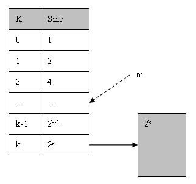
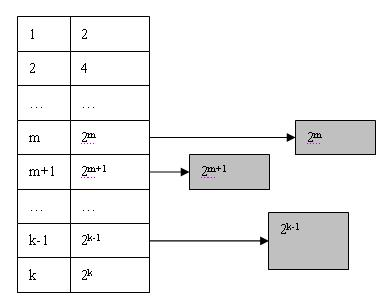

# 【原理】页内存分配算法

在proj5中进行在动态分配内存时，存在很多限制，效率很低。在操作系统原理中，为了有效地分配内存，首先需要了解和跟踪空闲内存和分布情况，一般可采用位图（bit map）和双向链表两种方式跟踪内存使用情况。若采用位图方式，则每个页对应位图区域的一个bit，如果此位为0，表示空闲，如果为1，表示被占用。采用位图方式很省空间，但查找n个长度为0的位串的开销比较大。而双向链表在查询或修改操作方面灵活性和效率较高，所以ucore采用双向链表来跟踪跟踪内存使用情况。

假设整个物理内存空闲空间的以页为单位被一个双向链表管理起来，每个表项管理一个物理页。这需要设计某种算法来查找空闲页和回收空闲页。ucore实现了首次适配（first fit）算法、最佳适配（best fit）算法、最差适配（worst fit）算法和兄弟（buddy）算法，这些算法都可以实现在ucore提供的物理内存页管理器框架pmm_manager下。

首次适配（first fit）算法的分配内存的设计思路是物理内存页管理器顺着双向链表进行搜索空闲内存区域，直到找到一个足够大的空闲区域，这是一种速度很快的算法，因为它尽可能少地搜索链表。如果空闲区域的大小和申请分配的大小正好一样，则把这个空闲区域分配出去，成功返回；否则将该空闲区分为两部分，一部分区域与申请分配的大小相等，把它分配出去，剩下的一部分区域形成新的空闲区。其释放内存的设计思路很简单，只需把这块区域重新放回双向链表中即可。

最佳适配（best fit）算法的设计思路是物理内存页管理器搜索整个双向链表（从开始到结束），找出能够满足申请分配的空间大小的最小空闲区域。找到这个区域后的处理以及释放内存的处理与上面类似。最佳适配算法试图找出最接近实际需要的空闲区，名字上听起来很好，其实在查询速度上较慢，且较易产生多的内存碎片。

最差适配（worst fit）算法与最佳适配（best fit）算法的设计思路相反，物理内存页管理器搜索整个双向链表，找出能够满足申请分配的空间大小的最大空闲区域，使新的空闲区比较大从而可以继续使用。在实际效果上，查询速度上也较慢，产生内存碎片相对少些。

上述三种算法在实际应用中都会产生碎片较多，效率不高的问题。为此一般操作系统会采用buddy算法来改进上述问题。buddy算法的基本设计思想是：在buddy系统中，被占用的内存空间和空闲内存空间的大小均为2的k次幂（k是正整数）。这样在ucore中，若申请n个页的内存空间，则实际可能分配的空间大小为2K个页（2k-1\<n<=2k）。若初始化时的空闲内存空间容量为2m个页，这空闲块的大小只可能是20、21、…、2m个页。

假定内存一开始是一个连续地址空间（大小为2^k个页）的大空闲块，且最小分配单位为1个页（4KB），则buddy system初始化时将生成一个长度为k + 1的可用空间表List, 并将全部可用空间作为一个大小为2^k个页的空闲块Bk挂接在空闲块数组链表List的最后一个节点上, 如下图：

当ucore其他子系统申请n个字节的存储空间时, buddy system分配的空闲块大小为2^ m个页，m满足条件：2^ (m-1) < n <= 2^ m 

此时buddy system将在list中的m位置寻找可用的空闲块。初始化时List中这个位置为空, 于是buddy system就向上查找m+1，…，直到达到k位置为止. 找到k位置后, 便得到可用空闲块Bk, 此时Bk将分裂成两个大小为2^(k-1)的空闲块Bk-1a和Bk-1b, 并将其中一个插入到List中k-1位置, 同时对另外一个继续进行分裂. 如此以往直到得到两个大小为2^m个页的块为止,并把其中一个空闲块分配给需求方。此时的内存如下图所示:

如果buddy system在运行一段时间之后, List中某个位置t可能会出现多个块, 则将其他块依次链接可用块链表的末尾。当buddy system要在t位置取可用块时, 直接从链表头取一个即可。

当一个存储块被释放时, buddy system将把此内存块回收到空闲块链表List中。此时buddy system系统将根据此存储块的大小计算出其在List中的位置, 然后插入到空闲块链表的末尾。在这一步完成后, 系统立即开始合并尝试操作， 该操作是将地址相邻且大小相等的空闲块（简称buddy，即"伙伴"空闲块）合并到一起, 形成一个更大的空闲块，并重新放到空闲块链表List的对应位置中, 并继续对更大的块进行合并, 直到无法合并为止。

严蔚敏老师的“数据结构”一书第8章第4节对buddy算法有详尽的解释，“understanding linux kernel”此书对此也有很好的描述，读者可以进一步参考。

对于上述4个内存分配算法，可参考对应的proj5.1/5.1.1/5.1.2/5.2中的kern/mm/*_pmm.[ch]的具体实现来进一步了解。

`（可以进一步描述三种算法的具体实现）`