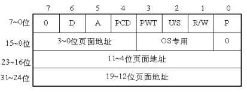
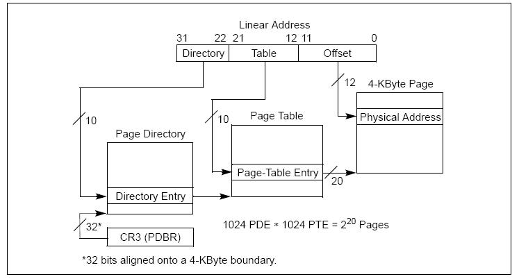

# 【背景】X86的分页硬件支持

X86 CPU对实际物理内存的访问是通过连接着CPU和北桥芯片的前端总线来完成的，在前端总线上传输的内存地址是物理内存地址。物理内存地址被北桥映射到实际的内存条中的内存单元相应位置上。然而，在CPU内执行带来软件所使用的是虚拟内存地址（也称逻辑内存地址），它必须被转换成物理地址后，才能用于实际内存访问。

前面已经讲过了80x86的分段机制，80x86的分页机制建立在其分段机制基础之上，提供了更加强大的内存管理支持。需要注意的是，在x86中，必须先有分段机制，才能有分页机制。在分段机制中，虚地址会转换为线性地址。如果不启动分页机制，那么线性地址就是最终在前端总线上的物理地址；如果启动了分页机制，则线性地址还会经过页映射被转换为物理地址。

那如果启动分页机制呢？在80x86中有一个CR0控制寄存器，它包含一个PG位，如果PG=1，启用分页机制；如果 PG=0，禁用分页机制。不像分段机制管理大小不固定的内存卡，分页机制以固定大小的存储块为最小管理单位，即把整个地址空间（包括线性地址和物理地址）都看成由固定大小的存储块组成。在80x86中，这个固定大小一般设定为4096字节。在线性地址空间中的最小管理单位（称为页（page）），可以映射到物理地址空间中的任何一个最小管理单位（称为页帧（page frame））。页/页帧的32位地址由20位的页号/页帧号和12位的页/页帧内偏移组成。

80x86分页机制中的分页转换功能（即线性地址到物理地址的映射功能）需采用驻留在内存中的数组来描述，该数组称为页表（page table）。每个数组项就是一个页表项。由于页/页帧基地址按4096字节对齐，因此页/页帧的基地址的低12位是0。页地址<->页帧地址的转换过程以简单地看做80x86对页表的一个查找过程。页地址（线性地址）的高20位（即页号，or页的基地址）构成这个数组的索引值，用于选择对应页帧的页帧号（即页帧的基地址）。页地址的低12位给出了页内偏移量，加上对应的页帧基地址就最终形成对应的页帧地址（即物理地址）。

由于80x86的地址空间可达到4GB，按页大小（4KB）划分为1M个页。如果用一个页表来描述这种映射，那么该也表就要有1M个表项，若每个表项占用4个字节，那么该映射表就要占用4M字节。考虑到将来一个进程就需要一个地址映射表，若有多个进程，那地址映射表所占的总空间将非常巨大。为避免地址映射表占用过多的内存资源，80x86把地址映射表设定为两级。地址映射表的第一级称为页目录表，存储在一个4KB的物理页中，页目录表共有1K个表项，其中每个表项为4字节长，页表项中包含对应第二级表所在的基地址。地址映射表的第二级称为页表，每个页表也安排在一个4K字节的页中，每张页表中有1K个表项，每个表项为4字节长，包含对应页帧的基地址。由于页目录表和页表均由1K个表项组成，所以使用10位的索引就能指定表项，即用10位的索引值乘以4加基地址就得到了表项的物理地址。按上述的地址转换描述，一个页表项只需20位，但实际的页表项是32位，那其他的12位有何用途呢？

在80x86中的的页目录表项结构定义如下所示：

在80x86中的的页表项结构定义如下所示：

其中低12位的相应属性位含义如下：

* P位：存在（Present）标志，用于指明此表项是否有效。P=1表示有效；P=0表示无效。如果80x86访问一个无效的表项，则会产生一个异常。如果P=0，那么除表示表项无效外，其余位用于其他用途（比如swap in/out中，用来保存已存储在磁盘上的页面的序号）。
* R/W：读/写（Read/Write）标志，如果R/W=1，表示页的内容可以被读、写或执行。如果R/W=0，表示页的内容只读或可执行。当处理器运行在特权级（级别0、1或2）时，则R/W位不起作用。
* U/S：是用户态/特权态（User/Supervisor）标志。如果U/S=1，那么在用户态和特权态都可以访问该页。如果U/S=0，那么只能在特权态（0、1或2）可访问该页。
* A：是已访问（Accessed）标志。当CPU访问页表项映射的物理页时，页表项的这个标志就会被置为1。可通过软件把该标志位清零，并且操作系统可通过该标志来统计页的使用情况，用于页替换策略。
* D：是页面已被修改（Dirty）标志。当CPU写页表项映射的物理页内容时，页表项的这个标志就会被置为1。可通过软件把该标志位清零，并且操作系统可通过该标志来统计页的修改情况，用于页替换策略。

下图显示了由页目录表和页表构成的二级页表映射架构。

图  页目录表和页表构成的二级页表映射架构

从图中可见，控制寄存器CR3的内容是对应页目录表的物理基地址；页目录表可以指定1K个页表，这些页表可以分散存放在任意的物理页中，而不需要连续存放；每张页表可以指定1K个任意物理地址空间的页。存储页目录表和页表的基地址是按4KB对齐。当采用上述页表结构后，基于分页的线性地址到物理地址的转换过程如下图所示：

首先，CPU把控制寄存器CR3的高20位作为页目录表所在物理页的物理基地址，再把需要进行地址转换的线性地址的最高10位(即22~ 31位)作为页目录表的索引，查找到对应的页目录表项，这个表项中所包含的高20位是对应的页表所在物理页的物理基地址；然后，再把线性地址的中间10位(即12~21位)作为页表中的页表项索引，查找到对应的页表项，这个表项所包含的的高20位作为线性地址的基地址（即页号）对应的物理地址的基地址（即页帧号）；最后，把页帧号作为32位物理地址的高20位，把线性地址的低12位不加改变地作为32位物理地址的低12位，形成最终的物理地址。 

如果每次访问内存单元都要访问位于内存中的页表，则访存开销太大。为了避免这类开销，x86 CPU把最近使用的地址映射数据存储在其内部的页转换高速缓存（页转换查找缓存，简称TLB）中。这样在访问存储器页表之前总是先查阅高速缓存，仅当必须的转换不在高速缓存中时，才访问存储器中的两级页表。