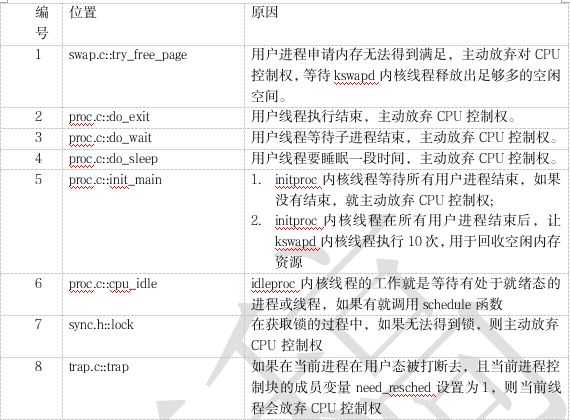
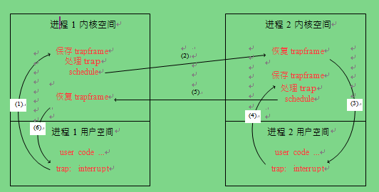

# 【实现】进程调度

## 内核的抢占性

调度本质上体现了对CPU资源的抢占。对于用户进程而言，由于有中断的产生，可以随时打断用户进程的执行，转到操作系统内部，从而给了操作系统以调度控制权，让操作系统可以根据具体情况（比如用户进程时间片已经用完了）选择其他用户进程执行。这体现了用户进程的可抢占性（preemptive）。但如果把ucore操作系统也看成是一个特殊的内核进程或多个内核线程的集合，那ucore是否也是可抢占的呢？其实ucore 内核执行是不可抢占的（non-preemptive），即在执行“任意”内核代码时，CPU控制权可被强制剥夺。这里需要注意，不是在所有情况下ucore内核执行都是不可抢占的，有以下几种“固定”情况是例外：

1. 进行同步互斥操作，比如争抢一个信号量、锁（lab5中会详细分析）；
2. 进行磁盘读写等耗时的异步操作，由于等待完成的耗时太长，ucore会调用shcedule让其他就绪进程执行。

这几种情况其实都是由于当前进程所需的某个资源（也可称为事件）无法得到满足，无法继续执行下去，从而不得不主动放弃对CPU的控制权。如果参照用户进程任何位置都可被内核打断并放弃CPU控制权的情况，这些在内核中放弃CPU控制权的执行地点是“固定”而不是“任意”的，不能体现内核任意位置都可抢占性的特点。我们搜寻一下proj13的代码，可发现在如下几处地方调用了shedule函数：

调用进程调度函数schedule的位置和原因

仔细分析上述位置，第1、2、3、4、7处的执行位置体现了由于访问磁盘数据的资源或获取锁资源一时等不到满足、进程要退出、进程要睡眠等原因而不得不主动放弃CPU。第5、6处的执行位置比较特殊，initproc内核线程等待用户进程结束和执行kwapd内核线程而执行schedule函数；idle内核线程在没有进程处于就绪态时才执行，一旦有了就绪态的进程，它将执行schedule函数完成进程调度。这里只有第8处的位置比较特殊：

       if (!in_kernel) {
            ……
           if (current->need_resched) {
                schedule();
            }
        }

这里表明了只有当进程在用户态执行到”任意”某处用户代码位置时发生了中断，且当前进程控制块成员变量need_resched为1（表示需要调度了）时，才会执行shedule函数。这实际上体现了对用户进程的可抢占性。如果没有第一行的if语句，那么就可以体现对内核代码的可抢占性。但如果要把这一行if语句去掉，我们不得不实现对ucore中的所有全局变量的互斥访问操作，以防止所谓的race condition现象（在lab5中有进一步讲述），这样ucore的实现复杂度会增加不少。

## 进程调度时机

我们可以知道ucore通过进程控制块的state成员变量来表示进程的运行状态，而且处于就绪态的进程和运行态的进程在ucore中的运行状态都是PROC_RUNNABLE。那如何进一步区分处于就绪态的进程和运行态的进程呢？在ucore中，所有处于就绪态的进程会链接在一个就绪队列rq（run queue的简称），而处于运行态的进程实际上市从就绪队列rq中被进程调度器选择出来的一个进程，此进程会从此就绪队列中断开，并开始占用CPU执行。这说明，没有挂在就绪队列且运行状态为PROC_RUNNABLE的进程是处于运行态的进程。

根据进程状态变化过程的分析，我们可以知道选择一个进程，把它从就绪态转变到运行态是进程调度器的主要工作。在ucore内核中哪些地方会进行调度呢？这其实与进程的运行状态变化的时机相关，回想4.4.5小节描述的进程状态变化过程，可以知道在如下一些地方是需要进行进程调度的。这里需要更深入地分析从运行态到其他状态相关转换的情况

### 运行态到就绪态的变化过程

首先来看运行态到就绪态的变化过程。进程主动/被动放弃CPU回到就绪态的起因有两个。一个起因是用户进程主动从运行态回到就绪态，即用户进程调用yield用户态库函数，此库函数接下来的调用路径如下：

	yield(用户态)-->sys_yeild(用户态)-->sys_yeild（内核态）-->do_yield(内核态)
    
do_yeild内核函数仅仅把当前进程的进程控制块成员变量need_resched设置为1。

    int
    do_yield(void) {
        current->need_resched = 1;
        return 0;
    }
  
另外一个起因是在进程调度器采用类似时间片轮转调度（RR）策略的前提下，用户进程由于时间片用完被动地从运行态回到就绪态的情况，即当时钟中断积累到一定的时间片段（给用户进程设置能够持续占用CPU运行的时间）后，如果一个用户进程还在持续运行，则ucore需要强制剥夺用户进程的CPU使用权，即把当前进程重新插入到就绪队列中，并从就绪队列中再选择另外一个“合适”的进程执行。时钟中断产生后，整个执行过程的函数调用路径如下：

    vetcor32-->__alltraps-->trap-->trap_dispatch-->run_timer_list -->sched_class_proc_tick-->XXX_proc_tick

注意XXX_proc_tick是某个具体进程调度器XXX对产生时钟中断后的特定处理函数。比如对于FCFS调度器而言，它没有考虑时间片轮转的情形，所以实际的FCFS_proc_tick函数啥也没干。但如果是RR调度器（在lab4/proj13.1中实现），这实际的RR_proc_tick则需要递减当前进程拥有的时间片，并判断当前进程的时间片是否已经用完，如果用完了，则需要把当前进程的进程控制块成员变量need_resched设置为1。

    static void
    RR_proc_tick(struct run_queue *rq, struct proc_struct *proc) {
        if (proc->time_slice > 0) {
            proc->time_slice --;
        }
        if (proc->time_slice == 0) {
            proc->need_resched = 1;
        }
    }

其实把当前进程的进程控制块成员变量need_resched设置为1只是指出了需要调度，但并没有实现调度。那需要在哪里完成调度呢？注意到上一小节“内核的抢占性”中，我们可以看到，实际上ucore只是在中断或异常返回的时候，如果在用户态被中断的当前用户进程need_resched设置为1，则会执行schedule函数，完成进程调度与切换。

### 运行态到就睡眠态的变化过程

参考上表（调用进程调度函数schedule的位置和原因），我们可以看到有有三个地方：第1、3、4处的执行代码会导致当前进程转变到睡眠态。第一个是由于当前进程申请内存无法得到满足，需通过执行try_free_pages函数，主动放弃对CPU控制权，等待kswapd内核线程释放出足够多的空闲空间。这里采用了等待队列的机制实现进程睡眠：

    local_intr_save(intr_flag);
    {
        wait_init(wait, current);
        current->state = PROC_SLEEPING;
        current->wait_state = WT_KSWAPD;
        wait_queue_add(&kswapd_done, wait);
        if (kswapd->wait_state == WT_TIMER) {
            wakeup_proc(kswapd);
        }
    }
    local_intr_restore(intr_flag);
    schedule(); 

上述代码很清楚地表明了当前进程的状态转变为睡眠状态，睡眠原因是WT_KSWAPD，即等待内核线程kswapd释放出更多的空闲内存，并执行schedule函数，把自身从就绪队列中删除，并选择新的就绪进程占用CPU执行。
第二个是do_wait函数。用户进程执行wait/waitpid用户库函数,并进一步调用sys_wait用户函数和sys_wait内核函数后，将调用do_wait函数完成实际的父进程等待子进程的工作。相关代码如下：

	if (haskid) {
        current->state = PROC_SLEEPING;
        current->wait_state = WT_CHILD;
        schedule();
……
此函数判断如果当前进程有子进程，则会设置当前进程状态转变为睡眠状态，睡眠原因是WT_CHILD，即等待子进程结束，并执行schedule函数，把自身从就绪队列中删除，并选择新的就绪进程占用CPU执行。
第三个是do_sleep函数。用户进程执行sleep用户库函数来实现n毫秒睡眠，这将进一步调用sys_sleep用户函数和sys_sleep内核函数后，最终调用do_sleep完成实际的睡眠操作。相关代码如下：

	do_sleep(unsigned int time) {
        if (time == 0) {
            return 0;
        }
        bool intr_flag;
        local_intr_save(intr_flag);
        timer_t __timer, *timer = timer_init(&__timer, current, time);
        current->state = PROC_SLEEPING;
        current->wait_state = WT_TIMER;
        add_timer(timer);
        local_intr_restore(intr_flag);

        schedule();
         ……
    }
  
可以看出会设置当前进程状态转变为睡眠状态，睡眠原因是WT_TIMER，即等待定时器到时，并执行schedule函数，把自身从就绪队列中删除，并选择新的就绪进程占用CPU执行。这里采用了定时器机制（参见4.2.5小节），通过调用timer_init函数来创建定时器，并调用add_timer函数来设置定时器运转，当时间time到后，会唤醒当前进程。

### 运行态到就退出态的变化过程

当用户进程执行完毕（或者被要求强行退出）后，将执行do_exit函数完成对自身所占部分资源的回收，并执行进程调度切换。参考上表（调用进程调度函数schedule的位置和原因），我们可以看到第2处的do_exit函数的代码实现从运行态到退出态的变化过程，

    current->state = PROC_ZOMBIE;
    current->exit_code = error_code;
……
    schedule();

可以看出会设置当前进程状态转变为退出状态，并执行schedule函数，把自身从就绪队列中删除，并选择新的就绪进程占用CPU执行。

## 进程切换过程

进程切换的具体过程发生在内核态，我们以对于基于时间片的进程调度过程来具体分析两个进程切换的过程。首先在执行进程 1 的用户代码时，出现了一个 trap  (例如是一个 Timer中断)，这 个时候就会从进程 1 的用户态切换到内核态(过程(1))，并且保存好进程 1 的 trapframe； 当ucore在处理中断时发现此进程的时间片已经用完，就会设置进程1的进程控制块的need_resched为1，表明需要进行进程调度，ucore 于是进一步执行 schedule函数，并通过此函数把进程1重新放回就绪队列，选择了另一个进程—进程2，并把进程2从就绪队列中摘除，这时需要调用proc_run函数来具体完成进程切换了。我们来看看切换的过程：

    void
    proc_run(struct proc_struct *proc) {
        if (proc != current) {
            bool intr_flag;
            struct proc_struct *prev = current, *next = proc;
            local_intr_save(intr_flag);
            {
                current = proc;
                load_esp0(next->kstack + KSTACKSIZE);
                lcr3(next->cr3);
                switch_to(&(prev->context), &(next->context));
            }
            local_intr_restore(intr_flag);
        }
    }

从上面的代码可以看出，proc_run的函数参数proc是进程2，而current是进程1，首先调用load_esp0需要设置进程2用户态返回到内核态的内涵栈寄存器指针（即TS段的ESP0）；然后页表基址（CR3寄存器的内容）设置为进程2的页表基址，虽然换了一个页表基址，但由于所有进程在内核中都用的是同一个内核虚拟地址空间，所以切换后只要在内核态执行，并访问内核地址空间，那实际上没啥变化，而只是在进程2返回到用户态的时候，所用的用户地址空间与进程1的用户地址空间就不一样了；最后一步是调用switch_to函数切换进程运行相关的硬件寄存器内容（具体过程可回顾4.1.5节的第3小节“调度并执行内核线程initproc”）。一旦执行完switch_to的最后一个指令“RET”后，就彻底切换到进程2的执行环境了。

到了进程2的执行环境，首先继续执行进程 2 上一次在内核态的操作，并最终通过中断或异常的返回操作回到进程2的用户空间执行。类似上述描述过程，当进程 2 由于某种原因发生中断之后，并需要切换到进程 1；当再次切换到进程 1 时，会执行进程 1 上一次在内核调用 schedule (具体还要跟踪到 switch to 函数) 函数后的下一行代码，这行代码当然还是在进程1的上一次中断处理的位置处。最后当进程 1 的中断处理完毕的时候，执行权又会反交给进程 1 的用户代码。大致流程如下所示：

【问题】进程切换的工作可以在用户态实现吗？（提示，如果是用户线程，即执行环境不需要考虑页表和内核栈等，只在用户态执行，那就可以在用户态实现用户线程的切换，这就是通常用户态线程库的实现）

【问题】进程切换以后，当前进程是从哪里开始执行的？（提示，虽然还是同一个cpu，但是此时使用的资源已经完全不同了。）

【问题】内核在第一个用户进程运行的时候，需要进行哪些操作？（提示，内核运行第一个用户进程的过程，实际上是从启动时的内核状态切换到该程序的内核 状态的过程，而用户程序的起始状态的入口，即forkret等。）

## 进程调度类框架设计

### 设计思路

进程调度类框架的设计是为了更好地实行各种进程调度策略或算法，为此需要了解为了实行一个进程调度策略，到底需要实现哪些基本功能对应的数据结构？首先考虑到一个无论哪种调度算法都需要选择一个就绪进程来占用CPU运行。为此我们可把就绪进程组织起来，可用队列（双向链表）、二叉树、红黑树、数组…等不同的组织方式。

在操作方面，如果需要选择一个就绪进程，就可以从基于某种组织方式的就绪进程集合中选择出一个进程执行。需要注意，这里“选择”和“出”是两个操作，选择是在集合中挑选一个“合适”的进程，“出”意味着离开就绪进程集合。另外考虑到一个处于运行态的进程还会由于某种原因（比如时间片用完了）回到就绪态而不能继续占用CPU执行，这就会重新进入到就绪进程集合中。这两种情况就形成了调度器相关的三个基本操作：在就绪进程集合中选择、进入就绪进程集合和离开就绪进程集合。这三个操作属于调度器的基本操作。

在进程的执行过程中，就绪进程的等待时间和执行进程的执行时间是影响调度选择的重要因素，这两个因素随着时间的流逝和各种事件的发生在不停地变化，比如处于就绪态的进程等待调度的时间在增长，处于运行态的进程所消耗的时间片在减少等。这些进程状态变化的情况需要及时让进程调度器知道，便于选择更合适的进程执行。所以这种进程变化的情况就形成了调度器相关的一个变化感知操作： timer时间事件感知操作。这样在进程运行或等待的过程中，调度器可以调整进程控制块中与进程调度相关的属性值（比如消耗的时间片、进程优先级等），并可能导致对进程组织形式的调整（比如以时间片大小的顺序来重排双向链表等），并最终可能导致调选择新的进程占用CPU运行。这个操作属于调度器的进程调度属性调整操作。

### 数据结构和变量

在加上对进程调度相关所需的通用初始化操作，就形成了进程调度类框架的5个指针函数，每个具体的进程调度实例将分别实现这5个函数，完成不同的进程调度策略/算法。具体而言，在ucore中进程调度类定义如下：

    struct sched_class {
        // the name of sched_class
        const char *name;
        // Init the run queue
        void (*init)(struct run_queue *rq);
        // put the proc into runqueue, and this function must be called with rq_lock
        void (*enqueue)(struct run_queue *rq, struct proc_struct *proc);
        // get the proc out runqueue, and this function must be called with rq_lock
        void (*dequeue)(struct run_queue *rq, struct proc_struct *proc);
        // choose the next runnable task
        struct proc_struct *(*pick_next)(struct run_queue *rq);
        // dealer of the time-tick
        void (*proc_tick)(struct run_queue *rq, struct proc_struct *proc);
    };

这其实是对Linux内核的调度类的一种简化设计，需要注意这里的run_queue是就绪进程集合的一种组织方式，并不是特指队列（queue），我们根据调度算法的具体设计，也可采用Linux的CFS调度器的就绪进程队列组织结构--红黑树。在ucore中，不同调度算法需要设计不同的就绪进程队列组织结构。比如lab4/proj13实现的是FCFS调度算法，所以就绪进程只需能够按创建顺序链接如一个双向链表即可，为此设计的就绪进程队列组织结构就是一个双向链表：

    struct run_queue {
        list_entry_t run_list;
        unsigned int proc_num;
    };

在此结构中，还有一个proc_num成员变量，表示当前就绪进程的个数。对于lab4/proj13.1而言，它实现了RR调度算法，由于RR调度算法需要分析和调整每个进程的时间片，所以对就绪进程队列组织结构进行了小的扩展，增加了一个最大时间片的设定，用于比较当前进程的时间片是否已经超过了就绪进程队列设计的最大时间片范畴。其具体的设置如下：

    struct run_queue {
        list_entry_t run_list;
        unsigned int proc_num;
        int max_time_slice;
    };

对于lab4/proj13.2，实现了MLFQ调度算法，这里包含了4个不同级别的RR就绪队列，于是需要对就绪进程队列进行进一步扩展：

    struct run_queue {
        list_entry_t run_list;
        unsigned int proc_num;
        int max_time_slice;
        list_entry_t rq_link;
    };

其中增加的rq_link就用于把就绪进程放入到某个运行队列中。另外，对于RR调度算法和MLFQ调度算法而言，需要基于就绪进程和执行进程的时间片来调整就绪进程组织结构和抢占当前运行进程，所以需要对代表每个进程的进程控制块进行扩展，于是在lab4/proj13.1中对进程控制块进行了扩展，增加了time_slice成员变量来表示进程的时间片。

这样用于表示调度器操作的数据结构sched_class进程调度类和表示就绪进程组织形式的run_queue数据结构就绪进程队列就形成了进程调度类框架的主体。但如何在操作系统中运用这些数据结构，来实现与调度算法无关的调度框架呢？

### 调度点的关键调度相关函数

在本节中“进程调度时机”小节分析了进程在执行中状态变化过程的处理流程。虽然进程各种状态变化的原因和导致的调度处理各异，但其实仔细观察各个流程的共性部分，会发现其中只涉及了三个关键调度相关函数：wakup_proc、shedule、run_timer_list。如果我们能够让这三个调度相关函数的实现与具体调度算法无关，那么就可以认为ucore实现了一个与调度算法无关的调度框架。

wakeup_proc函数其实完成了把一个就绪进程放入到就绪进程队列中的工作，为此还调用了一个调度类接口函数sched_class_enqueue，这使得wakeup_proc的实现与具体调度算法无关。schedule函数完成了与调度框架和调度算法相关三件事情:把当前继续占用CPU执行的运行进程放放入到就绪进程队列中，从就绪进程队列中选择一个“合适”就绪进程，把这个“合适”的就绪进程从就绪进程队列中摘除。通过调用三个调度类接口函数sched_class_enqueue、sched_class_pick_next、sched_class_enqueue来使得完成这三件事情与具体的调度算法无关。run_timer_list函数在每次timer中断处理过程中被调用，从而可用来调用调度算法所需的timer时间事件感知操作，调整相关进程的进程调度相关的属性值。通过调用调度类接口函数sched_class_proc_tick使得此操作与具体调度算法无关。

这里涉及了一系列调度类接口函数：

    sched_class_enqueue
    sched_class_dequeue
    sched_class_pick_next
    sched_class_proc_tick

这4个函数的实现其实就是调用某基于sched_class数据结构的特定调度算法实现的4个指针函数。采用这样的调度类框架后，如果我们需要实现一个新的调度算法，则我们需要定义一个针对此算法的调度类的实例，一个就绪进程队列的组织结构描述就行了，其他的事情都可交给调度类框架来完成。

## 进程调度策略/算法

### FCFS调度算法的实现

FCFS调度算法不需要考虑执行进程的运行时间和就绪进程的等待时间，所以其实现很简单。首先其就绪进程队列是一个双向链表：

    struct run_queue {
        list_entry_t run_list;
        unsigned int proc_num;
    };

并在sched.c中声明了基于此数据结构的就绪进程队列rq。在执行wakup_proc时，把进程加入到就绪进程队列中（插入到rq的队列尾）。在执行schedule函数时，当前执行进程只会是已经退出或者已经睡眠两种情况，这时需要从就绪进程队列中选择最早进入就绪队列的进程（位于rq的队列头），然后把它从就绪队列中摘除。由于没有时间片的考虑，所以与run_timer_list函数相关的FCFS_proc_tick函数为空函数。我们在看看其他三个FCFS算法相关的函数实现。

FCFS_enqueue的函数实现如下：

    static void
    FCFS_enqueue(struct run_queue *rq, struct proc_struct *proc) {
        assert(list_empty(&(proc->run_link)));
        list_add_before(&(rq->run_list), &(proc->run_link));
        proc->rq = rq;
        rq->proc_num ++;
    }

即把一个就绪进程插入到就绪进程队列rq的队列尾，并把表示就绪进程个数的proc_num加一。

FCFS_pick_next的函数实现如下：

    static struct proc_struct *
    FCFS_pick_next(struct run_queue *rq) {
        list_entry_t *le = list_next(&(rq->run_list));
        if (le != &(rq->run_list)) {
            return le2proc(le, run_link);
        }
        return NULL;
    }

即选取就绪进程队列rq中的队头队列元素，并把队列元素转换成进程控制块指针。

FCFS_dequeue的函数实现如下：

    static void
    FCFS_dequeue(struct run_queue *rq, struct proc_struct *proc) {
        assert(!list_empty(&(proc->run_link)) && proc->rq == rq);
        list_del_init(&(proc->run_link));
        rq->proc_num --;
    }

即把就绪进程队列rq的进程控制块指针的队列元素删除，并把表示就绪进程个数的proc_num减一。

### RR调度算法的实现

RR调度算法的就绪队列在组织结构上也是一个双向链表，只是增加了一个成员变量，表明在此就绪进程队列中的最大执行时间片。而且在进程控制块proc_struct中增加了一个成员变量time_slice，用来记录进程当前的可运行时间片段。这是由于RR调度算法需要考虑执行进程的运行时间不能太长。在每个timer到时的时候，操作系统会递减当前执行进程的time_slice，当time_silce为0时，就意味着这个进程运行了一段时间（这个时间片段称为进程的时间片），需要把CPU让给其他进程执行，于是操作系统就需要让此进程重新回到rq的队列尾，且重置此进程的时间片为就绪队列的成员变量最大时间片max_time_slice值，然后再从rq的队列头取出一个新的进程执行。下面来分析一下其调度算法的实现。RR_dequeue和RR_pick_next的函数实现与FCFS_dequeue和FCFS_pick_next函数实现一致，这里不再赘述。

RR_enqueue的函数实现如下：

    static void
    RR_enqueue(struct run_queue *rq, struct proc_struct *proc) {
        assert(list_empty(&(proc->run_link)));
        list_add_before(&(rq->run_list), &(proc->run_link));
        if (proc->time_slice == 0 || proc->time_slice > rq->max_time_slice) {
            proc->time_slice = rq->max_time_slice;
        }
        proc->rq = rq;
        rq->proc_num ++;
    }

即把某进程的进程控制块指针放入到rq队列末尾，且如果进程控制块的时间片为0，则需要把它重置为rq成员变量max_time_slice。这表示如果进程在当前的执行时间片已经用完，需要等到下一次有机会运行时，才能再执行一段时间。

RR_proc_tick的函数实现如下：

    static void
    RR_proc_tick(struct run_queue *rq, struct proc_struct *proc) {
        if (proc->time_slice > 0) {
            proc->time_slice --;
        }
        if (proc->time_slice == 0) {
            proc->need_resched = 1;
        }
    }

即每次timer到时后，trap函数将会间接调用此函数来把当前执行进程的时间片time_slice减一。如果time_slice降到零，则设置此进程成员变量need_resched标识为1，这样在下一次中断来后执行trap函数时，会由于当前进程程成员变量need_resched标识为1而执行schedule函数，从而把当前执行进程放回就绪队列末尾，而从就绪队列头取出在就绪队列上等待时间最久的那个就绪进程执行。

### MLFQ调度算法的实现

当前MLFQ调度算法其实是对RR算法的进一步扩展，即把一个rq队列扩展为了n个rq队列。多个rq队列确保了长时间运行的进程优先级会随着执行时间的增加而降低，而短时间运行的进程会优于长时间运行的进程被先调度执行。在proj13.2中实现了一个比较简单的MLFQ调度算法，其就绪队列由4个双向链表组成（在sched.c中定义）：

	static struct run_queue __rq[4];

第i个rq的最大时间片为8*（1<<i），其中0<=i<4。创建的新进程首先会放到第0个rq中，这样新创建的进程的时间片为8（即第0个rq的最大时间片），如果进程用完了其时间片，则会降到第1个rq中，此时这个进程的时间片设置为16 （即第1个rq的最大时间片），持续下去，直到第3个rq，此时，此时这个进程的时间片设置为64 （即第3个rq的最大时间片）。

下面来分析一下其调度算法的实现。MLFQ_dequeue和MLFQ_proc_tick的函数实现就是直接调用RR_dequeue和RR_proc_tick函数，这里不再赘述。

MLFQ_enqueue的函数实现如下：

    static void
    MLFQ_enqueue(struct run_queue *rq, struct proc_struct *proc) {
        assert(list_empty(&(proc->run_link)));
        struct run_queue *nrq = rq;
        if (proc->rq != NULL && proc->time_slice == 0) {
            nrq = le2rq(list_next(&(proc->rq->rq_link)), rq_link);
            if (nrq == rq) {
                nrq = proc->rq;
            }
        }
        sched_class->enqueue(nrq, proc);
    }

如果判断进程proc的rq不为空且time_silce为0,则需要降rq队列，从rq[i]调整到rq[i+1]，如果是最后一个rq，即rq[3]，则继续保持在rq[3]中，然后调用RR_enqueue把proc插入到rq[i+1]中。

MLFQ_pick_next的函数实现如下：

    static struct proc_struct *
    MLFQ_pick_next(struct run_queue *rq) {
        struct proc_struct *next;
        list_entry_t *list = &(rq->rq_link), *le = list;
        do {
            if ((next = sched_class->pick_next(le2rq(le, rq_link))) != NULL) {
                break;
            }
            le = list_next(le);
        } while (le != list);
        return next;
    }

按顺序从rq[0]~rq[3]依次搜寻，直接调用RR_pick_next来查找某rq链表的头指向的就绪进程，只要找到就返回。

目前的实现其实相对简化了不少。我们把睡眠时间长的进程设定为IO-bounded进程。如果有一个进程经常等待某IO
事件（比如鼠标移动或按键），然后占用一部分CPU时间，但整体上执行了很长时间，则这类进程也算是IO-bounded进程，需要得到及时响应。如果采用上述MLFQ调度算法，则此进程也会落到rq[3]中执行，导致这类进程无法及时响应IO事件。出现这种原因的情况是上述调度算法只考虑了对运行的进程做降级惩罚操作（即只是根据运行时间的增加来递增i，使得运行时间长的进程最终都会落到rq[3]中），但对于睡眠很久的进程没有做升级奖励操作（即没有根据睡眠时间的增加来递减i，使得睡眠时间长的进程能够尽量保持在rq[0]中）。

【问题】对于新创建的子进程，在FCFS/RR/MLFQ调度算法如何设定其时间片比较合理？

【问题】如何扩展MLFQ调度算法，可减少长期运行的IO-bounded进程的响应时间？

【问题】如果需要实现内核级抢占（kernel preemptive）,需要如何设计ucore？
