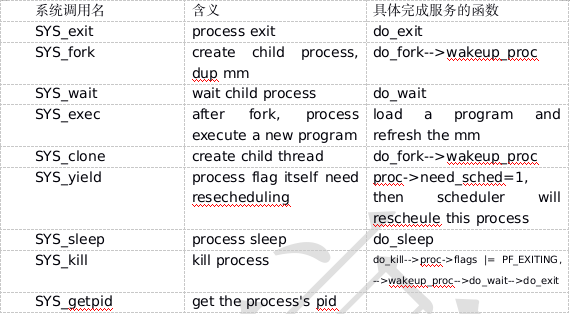

# 系统调用实现

系统调用的英文名字是System Call。操作系统为什么需要实现系统调用呢？其实这是实现了用户进程后，自然引申出来需要实现的操作系统功能。用户进程只能在操作系统给它圈定好的“用户环境”中执行，但“用户环境”限制了用户进程能够执行的指令，即用户进程只能执行一般的指令，无法执行特权指令。如果用户进程想执行一些需要特权指令的任务，比如通过网卡发网络包等，只能让操作系统来代劳了。于是就需要一种机制来确保用户进程不能执行特权指令，但能够请操作系统“帮忙”完成需要特权指令的任务，这种机制就是系统调用。

采用系统调用机制为用户进程提供一个获得操作系统服务的统一接口层，这样一来可简化用户进程的实现，把一些共性的、繁琐的、与硬件相关、与特权指令相关的任务放到操作系统层来实现，但提供一个简洁的接口给用户进程调用；二来这层接口事先可规定好，且严格检查用户进程传递进来的参数和操作系统要返回的数据，使得让操作系统给用户进程服务的同时，保护操作系统不会被用户进程破坏。

从硬件层面上看，需要硬件能够支持在用户态的用户进程通过某种机制切换到内核态。在第二章的2.4节和2.5节讲述中断硬件支持和软件处理过程其实就可以用来完成系统调用所需的软硬件支持。下面我们来看看如何在ucore中实现系统调用。

## 初始化系统调用对应的中断描述符
在ucore初始化函数kern_init中调用了idt_init函数来初始化中断描述符表。在proj10.1以前的一个proj4.4.1（其实proj4.4.1就是为proj10.1做准备的）中，为了实现了从用户态返回到内核态的功能，设置了一个特定中断号T_SWITCH_TOK的中断门，让用户态程序通过执行一个特殊的指令 “INT 中断号”来完成从用户态到内核态的切换，这个中断号就是T_SWITCH_TOK。proj10.1参考proj4.4.1的做法，首先要设置一个特定中断号的中断门，专门用于用户进程访问系统调用。此事由ide_init函数完成：

    void
    idt_init(void) {
        extern uintptr_t __vectors[];
        int i;
        for (i = 0; i < sizeof(idt) / sizeof(struct gatedesc); i ++) {
            SETGATE(idt[i], 1, GD_KTEXT, __vectors[i], DPL_KERNEL);
        }
        SETGATE(idt[T_SYSCALL], 1, GD_KTEXT, __vectors[T_SYSCALL], DPL_USER);
        lidt(&idt_pd);
    }

在上述代码中，可以看到在执行加载中断描述符表lidt指令前，专门设置了一个特殊的中断描述符idt[T_SYSCALL]，它的特权级设置为DPL_USER，中断向量处理地址在\__vectors[T_SYSCALL]处。这样建立好这个中断描述符后，一旦用户进程执行 “INT T_SYSCALL”后，由于此中断允许用户态进程产生（注意它的特权级设置为DPL_USER），所以CPU就会从用户态切换到内核态，保存相关寄存器，并跳转到\__vectors[T_SYSCALL]处开始执行，形成如下执行路径：

    vector128(vectors.S)--> __alltraps(trapentry.S)-->trap(trap.c)-->trap_dispatch(trap.c)--
    -->syscall(syscall.c)-
  
在syscall中，根据系统调用号来完成不同的系统调用服务。

## 建立系统调用的用户库准备

在操作系统中初始化好系统调用相关的中断描述符、中断处理起始地址等后，还需在用户态的应用程序中初始化好相关工作，简化应用程序访问系统调用的复杂性。为此在用户态建立了一个中间层，即简化的libc实现，在user/libs/ulib.[ch]和user/libs/syscall.[ch]中完成了对访问系统调用的封装。用户态最终的访问系统调用函数是syscall，实现如下：

    static inline int
    syscall(int num, ...) {
        va_list ap;
        va_start(ap, num);
        uint32_t a[MAX_ARGS];
        int i, ret;
        for (i = 0; i < MAX_ARGS; i ++) {
            a[i] = va_arg(ap, uint32_t);
        }
        va_end(ap);

        asm volatile (
            "int %1;"
            : "=a" (ret)
            : "i" (T_SYSCALL),
              "a" (num),
              "d" (a[0]),
              "c" (a[1]),
              "b" (a[2]),
              "D" (a[3]),
              "S" (a[4])
            : "cc", "memory");
        return ret;
    }

从中可以看出，应用程序调用的exit/fork/wait/getpid等库函数最终都会调用syscall函数，只是调用的参数不同而已，如果看最终的汇编代码会更清楚：

    ……
      34:	8b 55 d4             	mov    -0x2c(%ebp),%edx
      37:	8b 4d d8             	mov    -0x28(%ebp),%ecx
      3a:	8b 5d dc             	mov    -0x24(%ebp),%ebx
      3d:	8b 7d e0             	mov    -0x20(%ebp),%edi
      40:	8b 75 e4             	mov    -0x1c(%ebp),%esi
      43:	8b 45 08             	mov    0x8(%ebp),%eax
      46:	cd 80                	int    $0x80
          48:	89 45 f0             	mov    %eax,-0x10(%ebp)
    ……

可以看到其实是把系统调用号放到EAX，其他5个参数a[0]~a[4]分别保存到EDX/ECX/EBX/EDI/ESI五个寄存器中，及最多用6个寄存器来传递系统调用的参数，且系统调用的返回结果是EAX。比如对于getpid库函数而言，系统调用号（SYS_getpid=18）是保存在EAX中，返回值（调用此库函数的的当前进程号pid）也在EAX中。

## 与用户进程相关的系统调用

在proj10.1中，与进程相关的各个系统调用属性如下所示：

通过这些系统调用，可方便地完成从进程/线程创建到退出的整个运行过程。

## 系统调用的执行过程

与用户态的函数库调用执行过程相比，系统调用执行过程的有四点主要的不同：

* 不是通过“CALL”指令而是通过“INT”指令发起调用；
* 不是通过“RET”指令，而是通过“IRET”指令完成调用返回；
* 当到达内核态后，操作系统需要严格检查系统调用传递的参数，确保不破坏整个系统的安全性；
* 执行系统调用可导致进程等待某事件发生，从而可引起进程切换；

下面我们以getpid系统调用的执行过程大致看看操作系统是如何完成整个执行过程的。当用户进程调用getpid函数，最终执行到“INT T_SYSCALL”指令后，CPU根据操作系统建立的系统调用中断描述符，转入内核态，并跳转到vector128处（kern/trap/vectors.S），开始了操作系统的系统调用执行过程，函数调用和返回操作的关系如下所示：

    vector128(vectors.S)--> __alltraps(trapentry.S)-->trap(trap.c)-->trap_dispatch(trap.c)--
    -->syscall(syscall.c)-->sys_getpid(syscall.c)-->……-->__trapret(trapentry.S)
  
在执行trap函数前，软件还需进一步保存执行系统调用前的执行现场，即把与用户进程继续执行所需的相关寄存器等当前内容保存到当前进程的中断帧trapframe中（注意，在创建进程是，把进程的trapframe放在给进程的内核栈分配的空间的顶部）。软件做的工作在vector128和\__alltraps的起始部分：

    vectors.S::vector128起始处:
      pushl $0
      pushl $128
    ......
    trapentry.S::__alltraps起始处:
    pushl %ds
      pushl %es
      pushal
    ……

自此，用于保存用户态的用户进程执行现场的trapframe的内容填写完毕，操作系统可开始完成具体的系统调用服务。在sys_getpid函数中，简单地把当前进程的pid成员变量做为函数返回值就是一个具体的系统调用服务。完成服务后，操作系统按调用关系的路径原路返回到_\_alltraps中。然后操作系统开始根据当前进程的中断帧内容做恢复执行现场操作。其实就是把trapframe的一部分内容保存到寄存器内容。恢复寄存器内容结束后，调整内核堆栈指针到中断帧的tf_eip处，这是内核栈的结构如下：

    /* below here defined by x86 hardware */
        uintptr_t tf_eip;
        uint16_t tf_cs;
        uint16_t tf_padding3;
        uint32_t tf_eflags;
    /* below here only when crossing rings */
        uintptr_t tf_esp;
        uint16_t tf_ss;
        uint16_t tf_padding4;

这时执行“IRET”指令后，CPU根据内核栈的情况回复到用户态，并把EIP指向tf_eip的值，即“INT T_SYSCALL”后的那条指令。这样整个系统调用就执行完毕了。