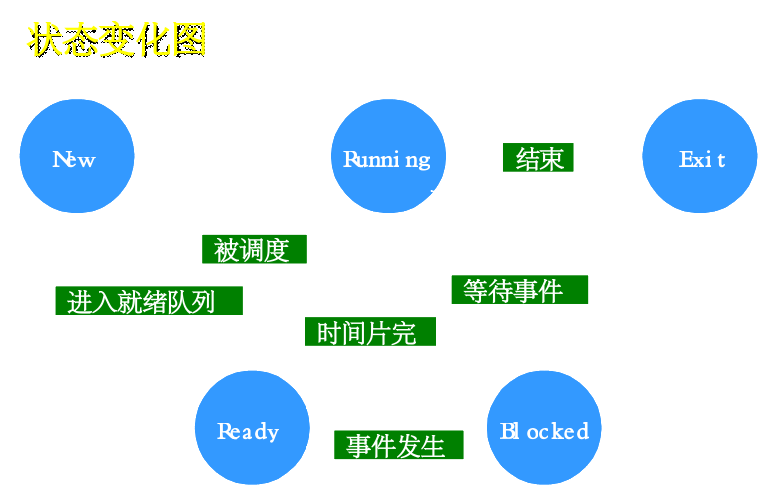

# 【原理】用户进程的特征

## 从内核线程到用户进程

在proj10中设计实现了进程控制块，并实现了内核线程的创建和简单的调度执行。但proj10中没有在用户态执行用户进程的管理机制，既无法体现用户进程的地址空间，以及用户进程间地址空间隔离的保护机制，不支持进程执行过程的用户态和核心态之间的切换，且没有用户进程的完整状态变化的生命周期。其实没有实现的原因是内核线程不需要这些功能。那内核线程相对于用户态线程有何特点呢？

但其实我们已经在proj10中看到了内核线程，内核线程的管理实现相对是简单的，其特点是直接使用操作系统（比如ucore）在初始化中建立的内核虚拟内存地址空间，不同的内核线程之间可以通过调度器实现线程间的切换，达到分时使用CPU的目的。由于内核虚拟内存空间是一一映射计算机系统的物理空间的，这使得可用空间的大小不会超过物理空间大小，所以操作系统程序员编写内核线程时，需要考虑到有限的地址空间，需要保证各个内核线程在执行过程中不会破坏操作系统的正常运行。这样在实现内核线程管理时，不必考虑涉及与进程相关的虚拟内存管理中的缺页处理、按需分页、写时复制、页换入换出等功能。如果在内核线程执行过程中出现了访存错误异常或内存不够的情况，就认为操作系统出现错误了，操作系统将直接宕机。在ucore中，就是调用panic函数，进入内核调试监控器kernel_debug_monitor。

内核线程管理思想相对简单，但编写内核线程对程序员的要求很高。从理论上讲（理想情况），如果程序员都是能够编写操作系统级别的“高手”，能够勤俭和高效地使用计算机系统中的资源，且这些“高手”都为他人着想，具有奉献精神，在别的应用需要计算机资源的时候，能够从大局出发，从整个系统的执行效率出发，让出自己占用的资源，那这些“高手”编写出来的程序直接作为内核线程运行即可，也就没有用户进程存在的必要了。

但现实与理论的差距是巨大的，能编写操作系统的程序员是极少数的，与当前的应用程序员相比，估计大约差了3~4个数量级。如果还要求编写操作系统的程序员考虑其他未知程序员的未知需求，那这样的程序员估计可以成为是编程界的“上帝”了。

从应用程序编写和运行的角度看，既然程序员都不是“上帝”，操作系统程序员就需要给应用程序员编写的程序提供一个既“宽松”又“严格”的执行环境，让对内存大小和CPU使用时间等资源的限制没有仔细考虑的应用程序都能在操作系统中正常运行，且即使程序太可靠，也只能破坏自己，而不能破坏其他运行程序和整个系统。“严格”就是安全性保证，即应用程序执行不会破坏在内存中存在的其他应用程序和操作系统的内存空间等独占的资源；“宽松”就算是方便性支持，即提供给应用程序尽量丰富的服务功能和一个远大于物理内存空间的虚拟地址空间，使得应用程序在执行过程中不必考虑很多繁琐的细节（比如如何初始化PCI总线和外设等，如果管理物理内存等）。

## 让用户进程正常运行的用户环境

在操作系统原理的介绍中，一般提到进程的概念其实主要是指用户进程。从操作系统的设计和实现的角度看，其实用户进程是指一个应用程序在操作系统提供的一个用户环境中的一次执行过程。这里的重点是用户环境。用户环境有啥功能？用户环境指的是什么？ 

从功能上看，操作系统提供的这个用户环境有两方面的特点。一方面与存储空间相关，即限制用户进程可以访问的物理地址空间，且让各个用户进程之间的物理内存空间访问不重叠，这样可以保证不同用户进程之间不能相互破坏各自的内存空间，利用虚拟内存的功能（页换入换出）。给用户进程提供了远大于实际物理内存空间的虚拟内存空间。

另一方面与执行指令相关，即限制用户进程可执行的指令，不能让用户进程执行特权指令（比如修改页表起始地址），从而保证用户进程无法破坏系统。但如果不能执行特权指令，则很多功能（比如访问磁盘等）无法实现，所以需要提供某种机制，让操作系统完成需要特权指令才能做的各种服务功能，给用户进程一个“服务窗口”,用户进程可以通过这个“窗口”向操作系统提出服务请求，由操作系统来帮助用户进程完成需要特权指令才能做的各种服务。另外，还要有一个“中断窗口”，让用户进程不主动放弃使用CPU时，操作系统能够通过这个“中断窗口”强制让用户进程放弃使用CPU，从而让其他用户进程有机会执行。

基于功能分析，我们就可以把这个用户环境定义为如下组成部分：

* 建立用户虚拟空间的页表和支持页换入换出机制的用户内存访存错误异常服务例程：提供地址隔离和超过物理空间大小的虚存空间。
* 应用程序执行的用户态CPU特权级：在用户态CPU特权级，应用程序只能执行一般指令，如果特权指令，结果不是无效就是产生“执行非法指令”异常；
* 系统调用机制：给用户进程提供“服务窗口”；
* 中断响应机制：给用户进程设置“中断窗口”，这样产生中断后，当前执行的用户进程将被强制打断，CPU控制权将被操作系统的中断服务例程使用。

## 用户态进程的执行过程分析

在这个环境下运行的进程就是用户进程。那如果用户进程由于某种原因下面进入内核态后，那在内核态执行的是什么呢？还是用户进程吗？首先分析一下用户进程这样会进入内核态呢？回顾一下lab1，就可以知道当产生外设中断、CPU执行异常（比如访存错误）、陷入（系统调用），用户进程就会切换到内核中的操作系统中来。表面上看，到内核态后，操作系统取得了CPU控制权，所以现在执行的应该是操作系统代码，由于此时CPU处于核心态特权级，所以操作系统的执行过程就就应该是内核进程了。这样理解忽略了操作系统的具体实现。如果考虑操作系统的具体实现，应该如果来理解进程呢？

从进程控制块的角度看，如果执行了进程执行现场（上下文）的切换，就认为到另外一个进程执行了，及进程的分界点设定在执行进程切换的前后。到底切换了什么呢？其实只是切换了进程的页表和相关硬件寄存器，这些信息都保存在进程控制块中的相关域中。所以，我们可以把执行应用程序的代码一直到执行操作系统中的进程切换处为止都认为是一个应用程序的执行过程（其中有操作系统的部分代码执行过过程）即进程。因为在这个过程中，没有更换到另外一个进程控制块的进程的页表和相关硬件寄存器。

从指令执行的角度看，如果再仔细分析一下操作系统这个软件的特点并细化一下进入内核原因，就可以看出进一步进行划分。操作系统的主要功能是给上层应用提供服务，管理整个计算机系统中的资源。所以操作系统虽然是一个软件，但其实是一个基于事件的软件，这里操作系统需要响应的事件包括三类：外设中断、CPU执行异常（比如访存错误）、陷入（系统调用）。如果用户进程通过系统调用要求操作系统提供服务，那么用户进程的角度看，操作系统就是一个特殊的软件库（比如相对于用户态的libc库，操作系统可看作是内核态的libc库），完成用户进程的需求，从执行逻辑上看，是用户进程“主观”执行的一部分，即用户进程“知道”操作系统要做的事情。那么在这种情况下，进程的代码空间包括用户态的执行程序和内核态响应用户进程通过系统调用而在核心特权态执行服务请求的操作系统代码，为此这种情况下的进程的内存虚拟空间也包括两部分：用户态的虚地址空间和核心态的虚地址空间。但如果此时发生的事件是外设中断和CPU执行异常，虽然CPU控制权也转入到操作系统中的中断服务例程，但这些内核执行代码执行过程是用户进程“不知道”的，是另外一段执行逻辑。那么在这种情况下，实际上是执行了两段目标不同的执行程序，一个是代表应用程序的用户进程，一个是代表中断服务例程处理外设中断和CPU执行异常的内核线程。这个用户进程和内核线程在产生中断或异常的时候，CPU硬件就完成了它们之间的指令流切换。

## 用户进程的运行状态分析

用户进程在其执行过程中会存在很多种不同的执行状态，根据操作系统原理，一个用户进程一般的运行状态有五种：创建（new）态、就绪（ready）态、运行（running）态、等待（blocked）态、退出（exit）态。各个状态之间会由于发生了某事件而进行状态转换。进程的状态转换图如下所示：

但在用户进程的执行过程中，具体在哪个时间段是出于上述状态的呢？上述状态是如何转变的呢？首先，我们看创建（new）态，操作系统完成进程的创建工作，而体现进程存在的就是进程控制块，所以一旦操作系统创建了进程控制块，则可以认为此时进程就已经存在了，但由于进程能够运行的各种资源还没准备好，所以此时的进程处于创建（new）态。创建了进程控制块后，进程并不能就执行了，还需准备好各种资源，如果把进程执行所需要的虚拟内存空间，执行代码，要处理的数据等都准备好了，则此时进程已经可以执行了，但还没有被操作系统调度，需要等待操作系统选择这个进程执行，于是把这个做好“执行准备”的进程放入到一个队列中，并可以认为此时进程处于就绪（ready）态。当操作系统的调度器从就绪进程队列中选择了一个就绪进程后，通过执行进程切换，就让这个被选上的就绪进程执行了，此时进程就处于运行（running）态了。到了运行态后，会出现三种事件。如果进程需要等待某个事件（比如主动睡眠10秒钟，或进程访问某个内存空间，但此内存空间被换出到硬盘swap分区中了，进程不得不等待操作系统把缓慢的硬盘上的数据重新读回到内存中），那么操作系统会把CPU给其他进程执行，并把进程状态从运行（running）态转换为等待（blocked）态。如果用户进程的应用程序逻辑流程执行结束了，那么操作系统会把CPU给其他进程执行，并把进程状态从运行（running）态转换为退出（exit）态，并准备回收用户进程占用的各种资源，当把表示整个进程存在的进程控制块也回收了，这进程就不存在了。在这整个回收过程中，进程都处于退出（exit）态。2考虑到在内存中存在多个处于就绪态的用户进程，但只有一个CPU，所以为了公平起见，每个就绪态进程都只有有限的时间片段，当一个运行态的进程用完了它的时间片段后，操作系统会剥夺此进程的CPU使用权，并把此进程状态从运行（running）态转换为就绪（ready）态，最后把CPU给其他进程执行。如果某个处于等待（blocked）态的进程所等待的事件产生了（比如睡眠时间到，或需要访问的数据已经从硬盘换入到内存中），则操作系统会通过把等待此事件的进程状态从等待（blocked）态转到就绪（ready）态。这样进程的整个状态转换形成了一个有限状态自动机。

有了上述对用户进程的特征分析后，接下来我们就通过跟踪用户进程的整个生命周期来阐述用户进程管理的设计与实现。